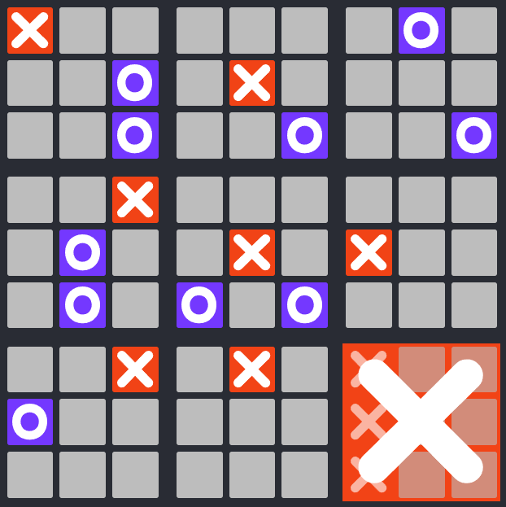

# Ultimate Tic-Tac-Toe

This is a web-based implementation of Ultimate Tic-Tac-Toe, built with React. It takes the classic Tic-Tac-Toe game to the next level by introducing a meta-board of 3x3 mini Tic-Tac-Toe boards.
Win three mini-boards in a row, column, or diagonal to claim victory!



## Getting Started

Follow these steps to run the game locally:

### Clone the repository

```
git clone https://github.com/tomas-sucena/2025-FEUP-IA.git
cd proj1
```

### Install Node.js & npm (if you don't have them)

👉 https://nodejs.org/en/download

### Install dependencies

```
npm install
```

### Start the server

```
npm start
```

The game will be available at http://localhost:3000.

## Game Rules (Quick Overview)

- The game consists of 9 Tic-Tac-Toe boards arranged in a 3x3 grid (default) but you are able to customize the board size.

- The board you must play on is determined by your opponent’s last move.

- Win mini-boards to claim them on the global board.

- First to win 3 mini-boards in a row, column, or diagonal (like in Tic-Tac-Toe) wins the game!

For a more in-depth explanation of the game, please click [here](https://en.wikipedia.org/wiki/Ultimate_tic-tac-toe).
